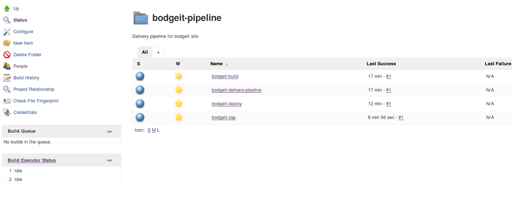

## Security scan in delivery pipeline.
  
Provisioning script contains all basic steps you need to complete, to get ready-to-use jenkins server.  
This project doesn't contain any raw xml config file for jenkins. Everything is created using groovy scripts.  
  
### What it is about:
https://jenkins.io/index.html  
https://wiki.jenkins-ci.org/display/JENKINS/zap+plugin  
https://www.owasp.org/index.php/OWASP_Zed_Attack_Proxy_Project  
https://wiki.jenkins-ci.org/display/JENKINS/Job+DSL+Plugin  
https://wiki.jenkins.io/display/JENKINS/Pipeline+Plugin  
  
### How to use.
* vagrant up
* Jenkins login: http://192.168.1.165:8080  
  **username:** admin  
  **password:** admin  
* start job "bodgeit-delivery-pipeline"
* OPTIONAL STEP  
  In browser: http://192.168.1.165:8181/bodgeit/register.jsp  
  	register **user:** zap@test.com  
  **password:** test123  
  ### IMPORTANT  
  **Other users will not work**

  
  
  
  
