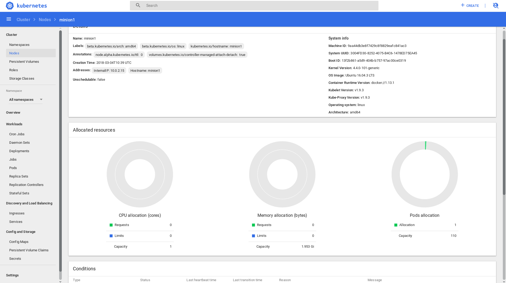

# KUBERNETES v1.9.3

This is an example how to provision minimum kubernetes eco-system(3 nodes cluster) from scratch. Nothing is prebuild.  


## IMPORTANT  
  DO NOT USE THIS ON PRODUCTION!!! NOT THIS REPO BUT KUBERNETES AT ALL!!!  
  Better to use something stable than install it because everybody talks about kubernetes, because DevOps means kubernetes, because in every job profile kubernetes is in the list. Think twice. Kubernetes is not user friendly. There are a lot of moving parts. You have to have clear understanding what they are and how they interact. Moreover, no documentation. Be ready to search in different sources apart from official documentation. https://kubernetes.io/docs is a puzzle and you must find all the pieces. It's like looking for treasure with old map which partially destroyed.  

  If you still want to have kubernetes, please DO NOT use kubeadm minikube or similar tools. Install every component by yourself doing this you will understand what is kubernetes and what is going on inside.

  Let God bless you!

## CLUSTER
3 virtualbox nodes:

| Hostname | IP            |  
|--------- | ------------- |  
| master   | 192.168.1.165 |  
| minion1  | 192.168.1.166 |  
| minion2  | 192.168.1.167 |  

etcd cluter:

| Hostname | IP            |  
|--------- | ------------- |  
| master   | 192.168.1.165 |  
| minion1  | 192.168.1.166 |  
| minion2  | 192.168.1.167 |  

kubernetes cluster:

| Service | IP  
| ---------- | ------------------------------ |  
| api server | 192.168.1.165                  |  
| scheduler  | 192.168.1.165                  |  
| controller | 192.168.1.165                  |  
| kubelet    | 192.168.1.166, 192.168.1.167   |  
| kube-proxy | 192.168.1.166, 192.168.1.167   |  

kubernetes addons:
* kube-dns
* kubernetes dashboard

## How to use it.  
  **etcd** is a place where kubernetes stores configuration/information. Network configuration in particular. That's why the very first command to build cluster have to be `vagrant up`. It makes initial provisioning and **etcd** configuration. **etcd** will be ready when nodes join the cluster. Literally, provisioning will fail during first run(`docker` stopped, `flannel` stopped). Next step is to run `vagrant provisioning`. When **etcd** is ready second run will start flannel and all kubernetes services. And `vagrant provision master` will check status of kubernetes nodes and applies addons (dns and dashboard) if nodes are `Ready` and hyperkube image has been downloaded.

## What's inside
  **master**. Basically master is a collection of static pods.  
  *Static pods are managed directly by kubelet daemon on a specific node, without the API server observing it.*
  https://kubernetes.io/docs/tasks/administer-cluster/static-pod/  
* api server
* scheduler
* controller

  `scheduler` and `controller` has `kubeconfig` file, in order to know, how to connect to api server.  
  https://kubernetes.io/docs/getting-started-guides/scratch/#preparing-credentials

**minion**. It is a node where containers will be running. `kubelet` and `kube-proxy` makes this happen.  
https://kubernetes.io/docs/concepts/overview/components/
They also look for kubeconfig files, since they communicate with api server as well.  

TLS is used. Connection between master and minion is encrypted and to join the cluster valid certificate is required.

## How provisioning works.
* Generate certificates.  
  https://jvns.ca/blog/2017/08/05/how-kubernetes-certificates-work/  
* Prepare etcd on every node is the cluster.  
  https://coreos.com/etcd/docs/latest/op-guide/clustering.html
* prepare flannel (or what ever else to build overlay network) on every node in the cluster  
  https://coreos.com/flannel/docs/latest/building.html  
  https://coreos.com/flannel/docs/latest/running.html  
* Prepare master server.
  https://kubernetes.io/docs/tasks/administer-cluster/static-pod/
  https://kubernetes.io/docs/getting-started-guides/scratch/#apiserver-controller-manager-and-scheduler  
  **What is important and is not described in official documentation.**  
  API server:  
  "--service-account-key-file=/etc/kubernetes/tls/apiserver.crt" mandatory for generating serviceaccount tokens.  
  "--storage-backend=etcd2" pay attantion to etcd version you use. Must be specified explicitly.  
  Controller:  
  "--service-account-private-key-file=/etc/kubernetes/tls/apiserver.key" must conform to API server option  
  Unfortunately there are more undocumented nuances most of them related to TLS.  
* Prepare minions. kube-proxy(makes service IP accessible within the cluster) and kublet service (responsible   for communication with api server)  
https://kubernetes.io/docs/getting-started-guides/scratch/#kubelet  
https://kubernetes.io/docs/getting-started-guides/scratch/#kube-proxy  
* Install addons like dns and dashboard. If cluster up and running try to access dashboard http://192.168.1.165:8001/api/v1/namespaces/kube-system/services/https:kubernetes-dashboard:/proxy/#!/cluster?namespace=kube-system  

## Commands you probably find useful
* kubectl get pods --all-namespaces -o wide - shows list of pods and their status.

```
root@master:/home/ubuntu# kubectl get pods --all-namespaces -o wide
NAMESPACE     NAME                                    READY     STATUS    RESTARTS   AGE       IP          NODE
kube-system   kube-dns-6844cfbdfb-wtc25               3/3       Running   0          1m        10.1.36.2   minion2
kube-system   kubernetes-dashboard-5bd6f767c7-p8z7l   1/1       Running   0          1m        10.1.56.2   minion1

```

* kubectl get nodes - list of nodes and their status.

```
root@master:/home/ubuntu# kubectl get nodes -o wide
NAME      STATUS    ROLES     AGE       VERSION   EXTERNAL-IP   OS-IMAGE             KERNEL-VERSION      CONTAINER-RUNTIME
minion1   Ready     <none>    48s       v1.9.3    <none>        Ubuntu 16.04.3 LTS   4.4.0-101-generic   docker://1.13.1
minion2   Ready     <none>    48s       v1.9.3    <none>        Ubuntu 16.04.3 LTS   4.4.0-101-generic   docker://1.13.1
```
* kubectl get events - Useful during troubleshooting

```
root@master:/home/ubuntu# kubectl get events -a
LAST SEEN   FIRST SEEN   COUNT     NAME                       KIND      SUBOBJECT   TYPE      REASON                    SOURCE             MESSAGE
4m          4m           8         minion1.1518b1533db01819   Node                  Normal    NodeHasSufficientDisk     kubelet, minion1   Node minion1 status is now: NodeHasSufficientDisk
4m          4m           8         minion1.1518b1533db6aa27   Node                  Normal    NodeHasSufficientMemory   kubelet, minion1   Node minion1 status is now: NodeHasSufficientMemory
4m          4m           7         minion1.1518b1533db6d614   Node                  Normal    NodeHasNoDiskPressure     kubelet, minion1   Node minion1 status is now: NodeHasNoDiskPressure
4m          4m           1         minion1.1518b153400bad04   Node                  Normal    NodeAllocatableEnforced   kubelet, minion1   Updated Node Allocatable limit across pods
2m          2m           1         minion1.1518b17222d1b07d   Node                  Normal    RegisteredNode            node-controller    Node minion1 event: Registered Node minion1 in Controller
6m          6m           8         minion2.1518b138da36e7fe   Node                  Normal    NodeHasSufficientDisk     kubelet, minion2   Node minion2 status is now: NodeHasSufficientDisk
6m          6m           8         minion2.1518b138da37310a   Node                  Normal    NodeHasSufficientMemory   kubelet, minion2   Node minion2 status is now: NodeHasSufficientMemory
6m          6m           7         minion2.1518b138da375e38   Node                  Normal    NodeHasNoDiskPressure     kubelet, minion2   Node minion2 status is now: NodeHasNoDiskPressure
2m          2m           1         minion2.1518b17222d401c8   Node                  Normal    RegisteredNode            node-controller    Node minion2 event: Registered Node minion2 in Controller
```

* docker logs [container_ID] - if container fails use it to find why.

```
I0304 10:47:48.196108       1 wrap.go:42] GET /api/v1/nodes/minion2?resourceVersion=0: (463.618µs) 200 [[kubelet/v1.9.3 (linux/amd64) kubernetes/d283541] 192.168.1.167:48672]
I0304 10:47:48.208157       1 wrap.go:42] PATCH /api/v1/nodes/minion2/status: (9.493691ms) 200 [[kubelet/v1.9.3 (linux/amd64) kubernetes/d283541] 192.168.1.167:48672]
I0304 10:47:48.280116       1 wrap.go:42] GET /api/v1/nodes/minion1?resourceVersion=0: (706.865µs) 200 [[kubelet/v1.9.3 (linux/amd64) kubernetes/d283541] 192.168.1.166:60232]
I0304 10:47:48.296822       1 wrap.go:42] PATCH /api/v1/nodes/minion1/status: (13.375941ms) 200 [[kubelet/v1.9.3 (linux/amd64) kubernetes/d283541] 192.168.1.166:60232]
I0304 10:47:49.091771       1 wrap.go:42] GET /api/v1/namespaces/kube-system/endpoints/kube-controller-manager: (4.491284ms) 200 [[hyperkube/v1.9.3 (linux/amd64) kubernetes/d283541/leader-election] 127.0.0.1:59098]
I0304 10:47:49.100727       1 wrap.go:42] PUT /api/v1/namespaces/kube-system/endpoints/kube-controller-manager: (8.472386ms) 200 [[hyperkube/v1.9.3 (linux/amd64) kubernetes/d283541/leader-election] 127.0.0.1:59098]
I0304 10:47:49.670342       1 wrap.go:42] GET /apis/batch/v1/jobs: (5.140011ms) 200 [[hyperkube/v1.9.3 (linux/amd64) kubernetes/d283541/cronjob-controller] 127.0.0.1:59098]
I0304 10:47:49.680048       1 wrap.go:42] GET /apis/batch/v1beta1/cronjobs: (9.148397ms) 200 [[hyperkube/v1.9.3 (linux/amd64) kubernetes/d283541/cronjob-controller] 127.0.0.1:59098]
I0304 10:47:51.018887       1 wrap.go:42] GET /api/v1/replicationcontrollers?resourceVersion=20&timeoutSeconds=493&watch=true: (8m13.06981293s) 200 [[hyperkube/v1.9.3 (linux/amd64) kubernetes/d283541/shared-informers] 127.0.0.1:58100]
I0304 10:47:51.019315       1 get.go:238] Starting watch for /api/v1/replicationcontrollers, rv=20 labels= fields= timeout=9m4s
I0304 10:47:51.107460       1 wrap.go:42] GET /api/v1/namespaces/kube-system/endpoints/kube-controller-manager: (5.003177ms) 200 [[hyperkube/v1.9.3 (linux/amd64) kubernetes/d283541/leader-election] 127.0.0.1:59098]
I0304 10:47:51.115557       1 wrap.go:42] PUT /api/v1/namespaces/kube-system/endpoints/kube-controller-manager: (7.764033ms) 200 [[hyperkube/v1.9.3 (linux/amd64) kubernetes/d283541/leader-election] 127.0.0.1:59098]
I0304 10:47:51.915826       1 wrap.go:42] GET /api/v1/services?resourceVersion=52&timeoutSeconds=494&watch=true: (8m14.02813401s) 200 [[hyperkube/v1.9.3 (linux/amd64) kubernetes/d283541/shared-informers] 127.0.0.1:57982]
I0304 10:47:51.916563       1 get.go:238] Starting watch for /api/v1/services, rv=166 labels= fields= timeout=8m28s
I0304 10:47:52.019667       1 wrap.go:42] GET /api/v1/nodes?resourceVersion=20&timeoutSeconds=499&watch=true: (8m19.013186031s) 200 [[hyperkube/v1.9.3 (linux/amd64) kubernetes/d283541/scheduler] 127.0.0.1:57946]
I0304 10:47:52.020327       1 get.go:238] Starting watch for /api/v1/nodes, rv=526 labels= fields= timeout=7m20s
I0304 10:47:53.126638       1 wrap.go:42] GET /api/v1/namespaces/kube-system/endpoints/kube-controller-manager: (4.732682ms) 200 [[hyperkube/v1.9.3 (linux/amd64) kubernetes/d283541/leader-election] 127.0.0.1:59098]
I0304 10:47:53.138431       1 wrap.go:42] PUT /api/v1/namespaces/kube-system/endpoints/kube-controller-manager: (11.402806ms) 200 [[hyperkube/v1.9.3 (linux/amd64) kubernetes/d283541/leader-election] 127.0.0.1:59098]
I0304 10:47:55.145315       1 wrap.go:42] GET /api/v1/namespaces/kube-system/endpoints/kube-controller-manager: (4.685468ms) 200 [[hyperkube/v1.9.3 (linux/amd64) kubernetes/d283541/leader-election] 127.0.0.1:59098]
```

